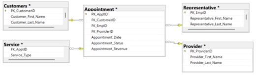
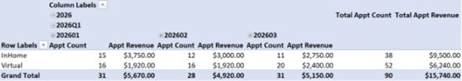
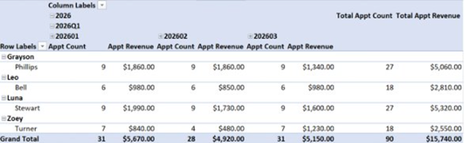
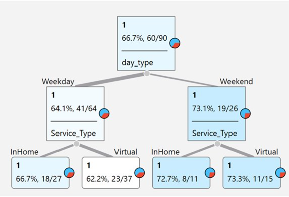
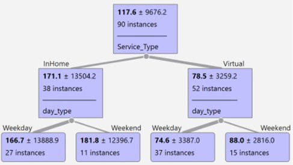

# Healthcare BI System Design

## Project Overview

This project designs an integrated Business Intelligence (BI) system for a healthcare appointment scheduling organization focused on operational reporting, revenue optimization, staffing analysis, and predictive decision support.

The solution combines relational database modeling, star schema warehousing, OLAP multidimensional analysis, and predictive modeling techniques to transform fragmented operational data into actionable business intelligence.

---

## Business Problem

Healthcare appointment scheduling operations generated large volumes of transactional data related to:

- Appointment activity
- Representative performance
- Revenue
- Service types
- Completion outcomes
- Scheduling trends

However, the data existed across disconnected systems, limiting the organization’s ability to support proactive operational and strategic decision-making.

---

## Technologies & Concepts Used

- SQL
- Relational Database Design
- Star Schema Architecture
- OLAP Cube Analysis
- Data Warehousing
- Decision Tree Modeling
- Business Intelligence Reporting
- Operational KPI Analysis

---

## Key Business Insights

- In-home appointments generated higher revenue than virtual appointments
- Weekend appointments demonstrated higher completion rates and expected revenue
- Representative-level analysis identified operational performance differences
- OLAP drill-down analysis supported staffing and scheduling optimization

---

## Repository Structure

```text
reports/   -> Executive BI system report
images/    -> Visualizations and architecture diagrams
data/      -> Supporting datasets
```

---

## Sample Visualizations

### Star Schema Architecture



Figure 1. Star schema architecture for the healthcare scheduling data mart showing relationships between the appointment fact table and supporting dimension tables.

---

### OLAP Service Type Analysis



Figure 2. OLAP cube analysis comparing appointment counts and revenue trends across service types over multiple reporting periods.

---

### Representative Performance Analysis



Figure 3. Representative-level OLAP analysis displaying appointment count and revenue performance differences.

---

### Decision Tree Completion Model



Figure 4. Decision tree classification model predicting appointment completion outcomes based on service type and scheduling period.

---

### Decision Tree Revenue Model



Figure 5. Decision tree regression model illustrating expected revenue outcomes across scheduling conditions.

---

## Author

Jose Reyes  
MS Business Analytics & Artificial Intelligence  
University of Texas Rio Grande Valley
